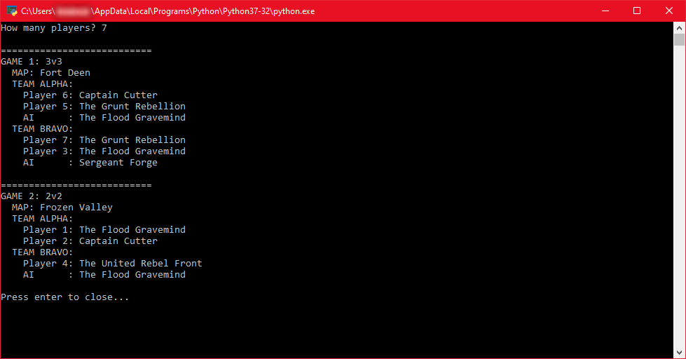

# HWRNG
Simple, fun Python Script that implements randomization of various settings of the video game Halo Wars to improve replayability of the game.
This script is based on Leader Overhaul mod (https://www.moddb.com/mods/halo-wars-leader-overhaul-mod/#8117934) and includes all leaders from it as of the September 2021 v1.6 update.

# Features
- Specify how many human players you'd like to play with (any number from 0 to infinity)
- The human players will be evenly distributed into the minimum number of games required for everyone to play
  - Using the Yates Shuffle, credit: https://bost.ocks.org/mike/shuffle/
- Specify the maximum number of human players per game by editing the variable ConfigMaxHumansPerGame near the top of HWRNG.py (default 6)
- Randomizes how many players will be on each team (aka team size; 1v1, 2v2, or 3v3)
  - Will only select options that are applicable for the number of human players per game
  - Human players will be randomly assigned to Team Alpha or Team Bravo, with a 50/50 chance of each
- All non-human player filled team slots will be filled by AI players
- Map will be randomized out of all available options for the given team size
- All players will be randomly assigned a leader to play
  - AIs will not be assigned the United Rebel Front, as AIs cannot play as that leader in this version of the mod

# Sample Output

# Libraries used
- Python's random (https://docs.python.org/3/library/random.html)
- Python's math (https://docs.python.org/3/library/math.html)
- Python's enum (https://docs.python.org/3/library/enum.html)

# Tools used
- Eclipse IDE (https://www.eclipse.org/ide/)
- PyDev plugin for Eclipse (https://www.pydev.org/index.html)
- GitHub
